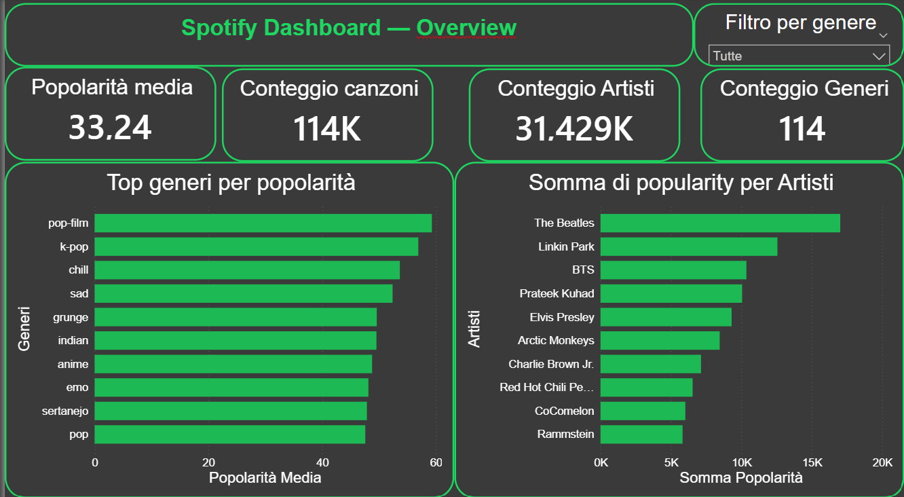
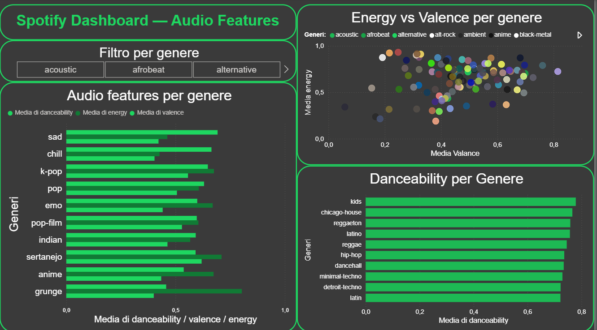
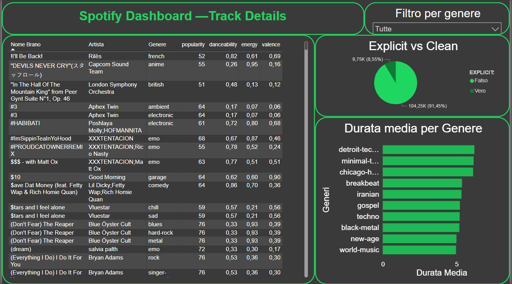

# Spotify Dashboard — Power BI

Dashboard interattivo realizzato con **Power BI Desktop** per analizzare dati musicali di Spotify: generi, artisti, popolarità e caratteristiche audio.

---

## Anteprima

| Overview | Audio Features | Track Details |
|----------|---------------|---------------|
|  |  |  |

---

## Pagine del Dashboard

### 1. Overview
- **4 KPI Card** — Tracce totali, Artisti unici, Popolarità media, Generi
- **Grafico a barre** — Top 10 generi per popolarità media
- **Grafico a barre** — Top 10 artisti più popolari
- **Slicer** — Filtro interattivo per genere

### 2. Audio Features
- **Scatter Chart** — Energy vs Valence per genere (con tooltip)
- **Grafico a barre** — Audio features medie per genere (danceability, energy, valence)
- **Grafico a barre** — Top 10 generi per danceability
- **Slicer** — Filtro interattivo per genere

### 3. Track Details
- **Tabella** — Top 50 tracce più popolari con tutte le features
- **Grafico a barre** — Durata media per genere (in minuti)
- **Grafico a torta** — Explicit vs Clean
- **Slicer** — Filtro interattivo per genere

---

## Struttura del Repository

```
spotify-powerbi-dashboard/
├── README.md
├── spotify_dashboard.pbix
├── screenshots/
│   ├── overview.png
│   ├── audio_features.png
│   └── track_details.png
└── data/
    └── spotify_tracks.csv
```

---

## Dataset

Il dataset utilizzato è disponibile su Kaggle:

[Spotify Tracks Dataset — Kaggle](https://www.kaggle.com/datasets/maharshipandya/-spotify-tracks-dataset)

**Colonne principali:**

| Colonna | Descrizione |
|---------|-------------|
| `track_id` | ID univoco Spotify |
| `track_name` | Nome della canzone |
| `artists` | Artista/i |
| `album_name` | Nome dell'album |
| `popularity` | Popolarità (0–100) |
| `duration_ms` | Durata in millisecondi |
| `explicit` | Contenuto esplicito (true/false) |
| `danceability` | Ballabilità (0.0–1.0) |
| `energy` | Energia (0.0–1.0) |
| `key` | Chiave musicale (0–11) |
| `loudness` | Volume in dB |
| `mode` | Modalità (1=Major, 0=Minor) |
| `speechiness` | Presenza parlato (0.0–1.0) |
| `acousticness` | Acusticità (0.0–1.0) |
| `instrumentalness` | Strumentalità (0.0–1.0) |
| `liveness` | Presenza pubblico (0.0–1.0) |
| `valence` | Positività (0.0–1.0) |
| `tempo` | BPM |
| `time_signature` | Battuta (3–7) |
| `track_genre` | Genere musicale |

---

## Come aprire il progetto

1. Scarica e installa [Power BI Desktop](https://powerbi.microsoft.com/it-it/desktop/) (gratuito)
2. Clona questo repository:
   ```bash
   git clone https://github.com/RockyT98/spotify-powerbi-dashboard.git
   ```
3. Apri il file `spotify_dashboard.pbix` con Power BI Desktop
4. Se richiesto, aggiorna il percorso del dataset:
   - **Home → Trasforma dati → Impostazioni origine dati**
   - Seleziona il file `spotify_tracks.csv` dalla cartella `data/`

---

## Scelte di Design

- Tema scuro ispirato all'interfaccia Spotify (`#121212` sfondo, `#1DB954` verde)
- Slicer interattivo per genere presente su tutte le pagine
- Tooltip sullo scatter chart per identificare i generi
- Filtri Top N per mostrare solo i dati più significativi

---

## Tecnologie

- **Power BI Desktop** — visualizzazione dati
- **Power Query (M)** — trasformazione e pulizia dati (colonna `duration_min`)

---

## Autore

**Rocco Tarantino**
- GitHub: https://github.com/RockyT98
